# 120 種顏色的英文！

你可能知道紅橙黃綠藍靛紫，但要是說到桃紅色、藍綠色、米白色等其他顏色，該如何用英文精確地表達，每個色彩又分別代表什麼意思呢？讓我們馬上揭開序幕吧！

## 顏色的英文？

顏色的美式英文是 **color**，英式英文拼法為 **colour**。以下為基本色彩的英文，包含彩虹七色和黑、灰、白、粉、皮膚色和棕色。

點選英文即可查看它們相呼應的色調（tone），再對應到完整的顏色中英文對照表，將各種五顏六色一網打盡喔！ 😉

| **代號**    | **色碼** | **顏色**  |
| ------------------------------------------------------------ | -------- | ---------------------------------------------------- |
| 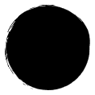 | #000000  | [black](https://english.cool/colors/#color1) 黑色    |
| 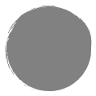 | #808080  | [grey](https://english.cool/colors/#color1) 灰色     |
| 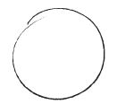 | #FFFFFF  | [white](https://english.cool/colors/#color1) 白色    |
| 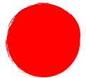   | #FF0000  | [red](https://english.cool/colors/#color4) 紅色      |
| 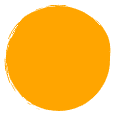 | #FFA500  | [orange](https://english.cool/colors/#color6) 橙色   |
| 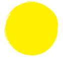 | #FFEF00  | [yellow](https://english.cool/colors/#color7) 黃色   |
| 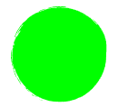 | #00FF00  | [green](https://english.cool/colors/#color9) 綠色    |
| 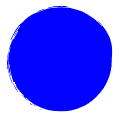 | #0000FF  | [blue](https://english.cool/colors/#color8) 藍色     |
| 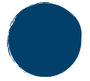 | #00416A  | [indigo](https://english.cool/colors/#color8) 靛青色 |
| 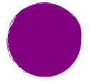 | #800080  | [purple](https://english.cool/colors/#color10) 紫色  |
| 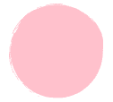 | #FFC0CB  | [pink](https://english.cool/colors/#color5) 粉紅色   |
| 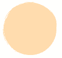 | #FFDBAC  | [skin](https://english.cool/colors/#color2) 皮膚色   |
| 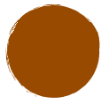 | #964B00  | [brown](https://english.cool/colors/#color3) 棕色    |

## 黑白灰色（無彩色）

黑、白、灰三色是色彩界中的無彩色（achromatic color），也就是除了彩色以外的其它顏色，常見的有金、銀、黑、白、灰。

黑色（**black**）可以展現出高貴、有權與神秘的懾人氣質，但也能給人嚴肅、冷漠或深沉的壓迫感，它可說是大部分顏色的好搭當，能夠讓其他色彩更加突顯。

相關詞彙：**emptiness**（n. 空洞）、**formality**（n. 莊重）、**mystery**（n. 神秘）、**power**（n. 權力）、**unhappiness**（n. 不快樂）、**boldness**（n. 大膽）、**death**（n. 死亡）

白色（**white**）的潔淨無暇會讓人直接聯想到純潔或純真等形容詞，雖然過多的白色會給人枯燥乏味的感覺，但適時穿著或使用白色，可製造信任感和乾淨俐落的印象。

相關詞彙：**purity**（n. 純潔）、**cleanliness**（n. 潔靜）、**innocence**（n. 天真）、**faith**（n. 信念）、**perfection**（n. 完美）、**dull**（adj. 枯燥的）

灰色（**grey**）介於黑與白之間，，混合黑與白截然相反的特性，在配色學上，幾乎可以和任何顏色搭配。

相關詞彙：**neutral**（adj. 中性的）、**timeless**（adj. 永恆的）、**practical**（adj. 實際的）

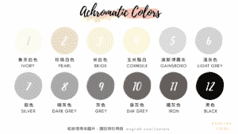

| **代號** | **色碼** | **顏色**             |
| -------- | -------- | -------------------- |
| 1        | #FFFFF0  | ivory 象牙白色       |
| 2        | #EAE0C8  | pearl 珍珠白色       |
| 3        | #F5F5DC  | beige 米白色         |
| 4        | #FFF8DC  | cornsilk 玉米鬚白    |
| 5        | #DCDCDC  | gainsboro 庚斯博羅灰 |
| 6        | #D3D3D3  | light grey 淺灰色    |
| 7        | #C0C0C0  | silver 銀色          |
| 8        | #A9A9A9  | dark grey 暗灰色     |
| 9        | #808080  | grey 灰色            |
| 10       | #696969  | dim grey 昏灰色      |
| 11       | #625B57  | iron 鐵灰色          |
| 12       | #000000  | black 黑色           |

## Skin Tone　皮膚色系

一般口語中的祼色就是指皮膚色，包含不同深淺的皮膚色、淺米色和象牙色等，都屬於此色系。

相關代表詞彙：**softness**（n. 柔和）、**plain**（adj. 樸素的）、**elegant**（adj. 優雅的）、**simplicity**（n. 簡約）

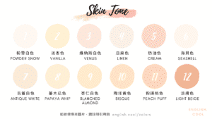

| **代號** | **色碼** | **顏色**                 |
| -------- | -------- | ------------------------ |
| 1        | #FDFAF0  | powder snow 粉雪白色     |
| 2        | #FEF3D1  | vanilla 淡杏色           |
| 3        | #FCE7DB  | venus 維納斯白色         |
| 4        | #FAF0E6  | linen 亞麻色             |
| 5        | #FBD7C9  | cream 奶油色             |
| 6        | #FFF5EE  | seashell 海貝色          |
| 7        | #FAEBD7  | antique white 古董白色   |
| 8        | #FFEFD5  | papaya whip 蕃木瓜色     |
| 9        | #FFEBCD  | blanched almond 杏仁白色 |
| 10       | #FFE4C4  | bisque 陶坯黃色          |
| 11       | #FFDAB9  | peach puff 粉撲桃色      |
| 12       | #F0B594  | light beige 淡膚色       |

## Earth Tone　大地色系

大地色顧名思義為土地的顏色，屬中性色彩，雖然經常被認為不夠鮮豔或有點無趣，但更能突顯成熟優雅，也給人穩定和容易相處的感覺，它可說是最代表本質的顏色，能為人帶來一份溫暖的好心情。

- 相關代表詞彙：**steadfastness**（n. 堅韌）、**healing**（adj. 治癒的）、**warmth**（n. 溫暖）、**reliability**（n. 可靠）、**nurturing**（adj. 滋養的）、**stability**（n. 穩定）

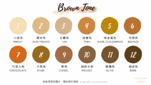

| **代號** | **色碼** | **顏色**                |
| -------- | -------- | ----------------------- |
| 1        | #F5DEB3  | wheat 小麥色            |
| 2        | #DEB887  | burlywood 硬木色        |
| 3        | #D2B48C  | tan 日曬色              |
| 4        | #CD853F  | peru 秘魯色             |
| 5        | #B8860B  | dark goldenrod 暗金菊色 |
| 6        | #B87333  | bronze 古銅色           |
| 7        | #D2691E  | chocolate 巧克力色      |
| 8        | #996B1F  | khaki 卡其色            |
| 9        | #A16B47  | camel 駝色              |
| 10       | #85653E  | walnut 胡桃木色         |
| 11       | #75542B  | olive 橄欖色            |
| 12       | #5C3E18  | bark 樹皮色             |

## Red Tone　紅色系

當你看到紅色，你會想到什麼呢？作為熱情的搶眼代表色，總免不了吸引人的注意，因為能讓人產生興奮感，還能促進食慾，所以餐廳品牌經常加入紅色的元素，默默透過色彩操控了人們的胃，果然做生意都是要用點小心機的啊！ 😎

雖然紅色是容易產生刺激感與散發冒險調性的顏色，但其強烈印象也帶有警示作用，偶爾可能激起挑釁意味，還是要小心使用呢！

- 相關代表詞彙：**love**（n. 愛）、**excitement**（n. 興奮）、**warmth**（n. 溫暖）、**blood**（n. 血）、**energy**（n. 活力）、**awareness**（n. 察覺）、**passionate**（adj. 熱情的）、**aggressive**（adj. 挑釁的）

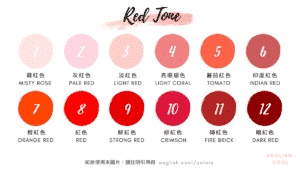

| **代號** | **色碼** | **顏色**             |
| -------- | -------- | -------------------- |
| 1        | #FFE4E1  | misty rose 霧紅色    |
| 2        | #FED3E2  | pale red 灰紅色      |
| 3        | #FFCCCB  | light red 淡紅色     |
| 4        | #F08080  | light coral 亮珊瑚色 |
| 5        | #FF6347  | tomato 蕃茄紅色      |
| 6        | #CD5C5C  | Indian red 印度紅色  |
| 7        | #FF4500  | orange red 橙紅色    |
| 8        | #FF0000  | red 紅色             |
| 9        | #E60000  | strong red 鮮紅色    |
| 10       | #DC143C  | crimson 緋紅色       |
| 11       | #B22222  | fire brick 磚紅色    |
| 12       | #8B0000  | dark red 暗紅色      |

## Pink Tone　粉色系

粉色散發著浪漫情懷，象徵可愛、溫柔和甜美，經常作為女性品牌的代表色，偏淡色系的粉色帶來柔和感，而較鮮豔的粉色則傳達青春氣息。粉色不僅與愛有深度連結，更是不具任何威脅性的色彩，帶有鎮定效果，能協助降低焦躁。

- 相關代表詞彙：**love**（n. 愛）、**feminine**（adj. 女性的）、**romantic**（adj. 浪漫的）、**intimate**（adj. 親密的）、**caring**（adj. 關愛的）

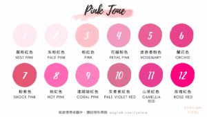

| **代號** | **色碼** | **顏色**                   |
| -------- | -------- | -------------------------- |
| 1        | #FEE9F2  | mist pink 霧粉紅色         |
| 2        | #FFECF5  | pale pink 灰粉紅色         |
| 3        | #FFC0CB  | pink 粉紅色                |
| 4        | #F099BF  | petal pink 花瓣粉色        |
| 5        | #E86094  | rosemary 迷迭香粉色        |
| 6        | #E6428B  | orchid 蘭花色              |
| 7        | #E45674  | shock pink 粉紫色          |
| 8        | #FF69B4  | hot pink 桃紅色            |
| 9        | #FF80BF  | coral pink 淺珊瑚紅色      |
| 10       | #DB7093  | pale violet red 灰青紫紅色 |
| 11       | #E63995  | camellia red 山茶紅色      |
| 12       | #FF007F  | rose red 玫瑰紅            |

## Orange Tone　橘色系

橘色混合熱情洋溢的紅色和光彩明亮的黃色，雖然對人的肉眼來說，容易帶來灼熱的感覺，但卻沒有紅色這麼強烈，且充滿朝氣，不但代表創造力，也令人產生愉悅感，像是我們的「英文庫」代表色就是橘色，是不是每天一開啟網站就莫名感到開心呢？ 😛

橘色在品牌應用上，經常被認為具有「友善」的特性，此外，更與紅色有異取同工之妙，同樣可以刺激食慾，與冷色系藍色搭配還有助於安定喔！

- 相關代表詞彙：**joy**（n. 快樂）、**enthusiasm**（n. 熱情）、**creativity**（n. 創意）、**success**（n. 成功）、**encouragement**（n. 鼓勵）、**stimulation**（n. 鼓舞）

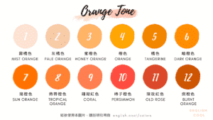

| **代號** | **色碼** | **顏色**                 |
| -------- | -------- | ------------------------ |
| 1        | #FDE3D3  | mist orange 霧橘色       |
| 2        | #F6CAA6  | pale orange 灰橘色       |
| 3        | #FFB366  | honey orange 蜜橙色      |
| 4        | #FFA500  | orange 橙色              |
| 5        | #F28500  | tangerine 橘色           |
| 6        | #FF8C00  | dark orange 暗橙色       |
| 7        | #FF7300  | sun orange 陽橙色        |
| 8        | #FF8033  | tropical orange 熱帶橙色 |
| 9        | #FF7F50  | coral 珊瑚紅色           |
| 10       | #FF4D40  | persimmon 杮子橙色       |
| 11       | #DB492A  | old rose 陳玫紅色        |
| 12       | #CC5500  | burnt orange 燃橙色      |

## Yellow Tone　黃色系

黃色能直接對應到陽光，能製造開心的感受，也能引起注意，有些食品業都喜歡以它作為品牌色，像是麥當勞就是很經典的例子。不過，對於男性來說，黃色多少顯得較不正經或幼稚，在德國則代表嫉妒，因此還是要依照場合小心使用喔！

- 相關代表詞彙：**sunshine**（n. 陽光）、**positivity**（n. 正面）、energy（n. 能量）、**joy**（n. 歡樂）、**confident**（adj. 自信的）

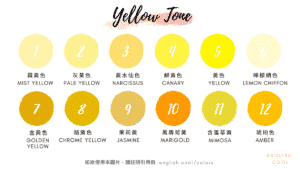

| **代號** | **色碼** | **顏色**               |
| -------- | -------- | ---------------------- |
| 1        | #FEF2AA  | mist yellow 霧黃色     |
| 2        | #FDF191  | pale yellow 灰黃色     |
| 3        | #FCDD6E  | narcissus 黃水仙色     |
| 4        | #FFF345  | canary 鮮黃色          |
| 5        | #FFEF00  | yellow 黃色            |
| 6        | #FFFACD  | lemon chiffon 檸檬綢色 |
| 7        | #E3AB06  | golden yellow 金黃色   |
| 8        | #E6B800  | chrome yellow 鉻黃色   |
| 9        | #E6C35C  | jasmine 茉莉黃         |
| 10       | #FF9900  | marigold 萬壽菊黃      |
| 11       | #E6D933  | mimosa 含羞草黃        |
| 12       | #FFBF00  | amber 琥珀色           |

## Blue Tone　藍色系

藍色被認為是世界上最安全的顏色，不但擁有鎮定的作用，也能表示知識，這樣沉穩的色彩非常廣泛被男性接受。由於它是海洋、天空與水的顏色，許多淨水器、航空或航海業會以藍色作為代表，同時也是科技業的愛好色。

需要注意的是，它也能表示抑鬱和傷心，這也是為什麼不少人一聽到 Blue Monday，就會心有威威焉的原因。

- 相關代表詞彙：**calm**（adj. 冷靜的）、**cold**（adj. 冷漠的）、**depressed**（adj. 憂鬱的）、**knowledge**（n. 知識）、**honesty**（n. 誠實）、**trust**（n. 信任）

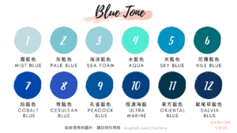

| **代號** | **色碼** | **顏色**               |
| -------- | -------- | ---------------------- |
| 1        | #C1DDDF  | mist blue 霧藍色       |
| 2        | #79C5CF  | pale blue 灰藍色       |
| 3        | #70C1CF  | sea foam 海沫藍色      |
| 4        | #50EAD1  | aqua 水藍色            |
| 5        | #0093C1  | sky blue 天藍色        |
| 6        | #006D77  | nile blue 尼羅藍色     |
| 7        | #0047AB  | cobalt blue 鈷藍色     |
| 8        | #2A52BE  | cerulean blue 天青藍色 |
| 9        | #00559A  | peacock blue 孔雀藍色  |
| 10       | #034081  | ultramarine 極濃海藍   |
| 11       | #02344B  | oriental blue 東方藍色 |
| 12       | #0E305D  | salvia blue 鼠尾草藍色 |

## Green Tone　綠色系

綠色一般會令人聯想到植物，是大自然界中常見的顏色，與介於藍色和綠色之間的藍綠色（**aquamarine**）同樣給人「清爽、健康」的印象，因此不少提倡環保或素食的品牌皆會使用綠色，同時能為人們帶來平靜的感受。

不過，撇除以上大眾認知，其實較有趣的一點在於綠色在英文中還有「嫉妒」的意味，據說古希臘女詩人莎芙以綠色形容因失戀而內心充滿妒意的人，後來才漸漸有了相關的引伸，學英文真的很有趣吧！ 😉

- 相關代表詞彙：**nature**（n. 自然）、**growth**（n. 成長）、**harmony**（n. 和諧）、**freshness**（n. 新鮮）、**safety**（n. 安全）、**environment**（n. 環境）

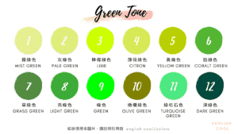

| **代號** | **色碼** | **顏色**                 |
| -------- | -------- | ------------------------ |
| 1        | #E5EE90  | mist green 霧綠色        |
| 2        | #DEEC7A  | pale green 灰綠色        |
| 3        | #D9E750  | lime 檸檬綠色            |
| 4        | #D7E854  | citron 薄荷綠色          |
| 5        | #B8CF01  | yellow green 黃綠色      |
| 6        | #55B532  | cobalt green 鈷綠色      |
| 7        | #528B40  | grass green 草綠色       |
| 8        | #3CAB38  | light green 亮綠色       |
| 9        | #00FF00  | green 綠色               |
| 10       | #808000  | olive green 欖橄綠色     |
| 11       | #4DE680  | turquoise green 綠松石色 |
| 12       | #006400  | dark green 深綠色        |

## Violet Tone　紫色系

紫色象微高貴、智慧、皇室與神秘，經常與宗教和信仰有所關連，像是日本在歷史上只有最高級別的和尚才能穿紫袍。

由於它是由強烈的暖色和冷色混合而成，因此保留兩者的屬性，將淡紫色用在女性身上，則容易帶給人優雅的形象，但相對來說，暗紫色偶爾會引起感傷與挫折感，仍需酌量使用。

- 相關代表詞彙：**luxury**（n. 高貴）、**mystery**（n. 神秘）、**wisdom**（n. 智慧）、**spirituality**（n. 靈性）、**power**（n. 力量）、**frustration**（n. 挫折）

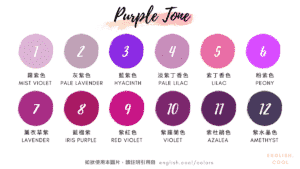

| **代號** | **色碼** | **顏色**              |
| -------- | -------- | --------------------- |
| 1        | #DDB4D4  | mist violet 霧紫色    |
| 2        | #BFA1B7  | pale lavender 灰紫色  |
| 3        | #8A2BE2  | hyacinth 藍紫色       |
| 4        | #C78CBA  | pale lilac 淡紫丁香色 |
| 5        | #E96FA4  | lilac 紫丁香色        |
| 6        | #D94DFF  | peony 粉紫色          |
| 7        | #A72D84  | lavender 薰衣草紫     |
| 8        | #A91A64  | iris purple 藍楹紫    |
| 9        | #C71585  | red violet 紫紅色     |
| 10       | #7C266D  | violet 紫羅蘭色       |
| 11       | #5F2660  | azalea 紫杜鵑色       |
| 12       | #2C1B48  | amethyst 紫水晶色     |

## That’s All for Today

顏色所蘊藏的意義真的不容小覷，看完這麼多色彩的代表詞、心理暗示，以及不同顏色的英文以後，你應該不只會說彩虹七色，還能表達更多美麗的色彩了吧！ 😎

記得下次遇到任何英文疑問時，要不時回到英文庫坐坐喔！

想看更多相關用法，可以參考以下文章：
👉「色彩學」英文怎麼說？
