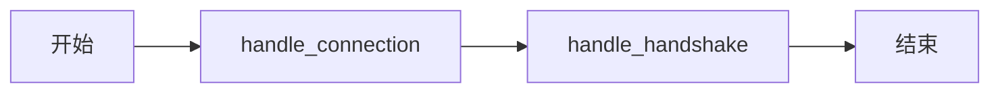
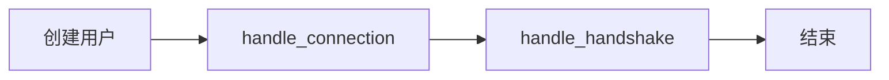

# Chat 客户端

目前（2023-06-11）该项目仅实现了后端主要功能，前端暂时只提供了3个静态页面验证功能，但url路径有错，与后端不匹配。计划在研读后端代码的同时，自己写一些前端代码来验证和运用后端Api。

## 准备环境

该项目采用了Docker容器来开发部署。
不改动原代码，自建子目录`Lee`存放自己的代码。

### 在项目根目录创建`.env`环境变量

```ini
BUILD_TYPE=release
LISTEN_ADDR=127.0.0.1:8080
POSTGRES_USER=user
POSTGRES_PASSWORD=password
POSTGRES_HOST=localhost
POSTGRES_DB=imdb
POSTGRES_PORT=5432
DATABASE_URL=postgres://${POSTGRES_USER}:${POSTGRES_PASSWORD}@${POSTGRES_HOST}:${POSTGRES_PORT}/${POSTGRES_DB}
MACHINE_ID=101
PROCESS_ID=101
```

### 运用docker提供postgresql服务

```yaml
# docker-compose.yml
version: "3"
  
services:
  chat_db:
    image: postgres:15-alpine
    restart: always
    volumes:
      - chat_db_volume:/var/lib/postgresql/data/
    ports:
      - 5432:5432
    environment:
      POSTGRES_DB: ${POSTGRES_DB:-chat}
      POSTGRES_USER: ${POSTGRES_USER:-postgres}
      POSTGRES_PASSWORD: ${POSTGRES_PASSWORD:?err}
      POSTGRES_PORT: ${POSTGRES_PORT:-5432}

volumes:
  chat_db_volume:
```

### 或本地安装postgresql数据库

```
scoop install postgresql
```

本目录下创建2个脚本用于创建、启动数据库

init.bat

```
@echo off

set PGDATA=%~dp0data

echo 初始化数据库
echo 只需首次运行一次

pause

initdb

pg_ctl start

createuser -dirS -P user
createdb -U user imdb

pg_ctl stop
```

pg.bat

```
@echo off

set PGDATA=%~dp0data

rem 启动数据库
set LANG=C
pg_ctl -l run.log start

rem 停止数据库
rem pg_ctl stop
```

### 安装 postgresql 客户端工具

```
scoop install heidisql
```

## 研读

### 先看看主代码`main.rs`逻辑

```rust
#[tokio::main]
async fn main() -> ExitCode {
	...
    let gateway_routes = gateway::handler::get_routes();
    let rest_routes = rest::routes::get_routes();

    tokio::select!(
        _ = handle_signals() => {}, // 处理ctrl-C
        _ = warp::serve(gateway_routes.or(rest_routes))
            .run(APP.config().listen_addr()) => {}
    );

    APP.close().await;
    ExitCode::SUCCESS
}
```

核心模块有2个 `gateway` 和 `rest`

#### gateway模块

主要用于处理websocket消息



```rust
/// A filter that can be used to handle the gateway
pub fn get_routes() -> BoxedFilter<(impl warp::Reply,)> {
    let inject_app = warp::any().map(move || &APP);

    warp::path("gateway")
        .and(warp::ws()) // <- The `ws()` filter will prepare Websocket handshake...
        .and(inject_app) // <- Use our shared state...
        .map(|ws: warp::ws::Ws, app: &'static _| {
            ws.on_upgrade(move |socket| handle_connection(app, socket))
            // <- call our handler
        })
        .boxed()
}
```

```rust
async fn handle_connection(app: &'static APP, socket: WebSocket) {
    let (mut ws_sink, mut ws_stream) = socket.split();
    // Handle handshake and get user
    let Ok(user) = handle_handshake(&mut ws_sink, &mut ws_stream).await else {
        ws_sink.reunite(ws_stream).unwrap().close().await.ok();
        return;
    };

    tracing::debug!("Connected: {} ({})", user.username(), user.id());

    let (sender, receiver) = mpsc::unbounded_channel::<GatewayEvent>();
    // turn receiver into a stream for easier handling
    let mut receiver = UnboundedReceiverStream::new(receiver);

    let user_id_i64: i64 = user.id().into();

    let guild_ids = sqlx::query!("SELECT guild_id FROM members WHERE user_id = $1", user_id_i64)
        .fetch_all(app.db.read().await.pool())
        .await
        .expect("Failed to fetch guilds during socket connection handling")
        .into_iter()
        .map(|row| row.guild_id.into())
        .collect::<HashSet<Snowflake>>();

    // Add user to peermap
    app.gateway
        .write()
        .await
        .peers
        .insert(user.id(), ConnectionHandle::new(sender, guild_ids.clone()));

    let guilds = user
        .fetch_guilds()
        .await
        .expect("Failed to fetch guilds during socket connection handling");

    let user = user.include_presence().await;

    ws_sink
        .send(Message::text(
            serde_json::to_string(&GatewayEvent::Ready(ReadyPayload::new(user.clone(), guilds.clone()))).unwrap(),
        ))
        .await
        .ok();

    // Send GUILD_CREATE events for all guilds the user is in
    for guild in guilds {
        let payload = GuildCreatePayload::from_guild(guild)
            .await
            .expect("Failed to fetch guild payload data");
        ws_sink
            .send(Message::text(
                serde_json::to_string(&GatewayEvent::GuildCreate(payload)).unwrap(),
            ))
            .await
            .ok();
    }

    // Send the presence update for the user if they are not invisible
    match user.last_presence() {
        Presence::Offline => {}
        _ => {
            app.gateway
                .write()
                .await
                .dispatch(GatewayEvent::PresenceUpdate(PresenceUpdatePayload {
                    user_id: user.id(),
                    presence: *user.last_presence(),
                }));
        }
    }

    // The sink needs to be shared between two tasks
    let ws_sink: Arc<Mutex<SplitSink<WebSocket, Message>>> = Arc::new(Mutex::new(ws_sink));
    let ws_sink_clone = ws_sink.clone();

    // Same for user_id, so we only want to copy the ID
    let user_id = user.id();

    // Send dispatched events to the user
    let send_events = tokio::spawn(async move {
        while let Some(payload) = receiver.next().await {
            let message = Message::text(serde_json::to_string(&payload).unwrap());
            if let Err(e) = ws_sink.lock().await.send(message).await {
                tracing::warn!("Error sending event to user {}: {}", user_id, e);
                break;
            }
        }
    });

    // Send a ping every 60 seconds to keep the connection alive
    // TODO: Rework to HEARTBEAT system
    let keep_alive = tokio::spawn(async move {
        loop {
            tokio::time::sleep(Duration::from_secs(60)).await;
            if let Err(e) = ws_sink_clone.lock().await.send(Message::ping(vec![])).await {
                tracing::debug!("Failed to keep alive socket connection to {}: {}", user_id, e);
                break;
            }
        }
    });

    // Listen for a close socket event
    let listen_for_close = tokio::spawn(async move {
        while let Some(msg) = ws_stream.next().await {
            if let Ok(msg) = msg {
                if msg.is_close() {
                    break;
                }
            }
        }
    });

    // Wait for any of the tasks to finish
    tokio::select! {
        _ = send_events => {},
        _ = listen_for_close => {},
        _ = keep_alive => {},
    }

    // Disconnection logic
    app.gateway.write().await.peers.remove(&user.id());
    tracing::debug!("Disconnected: {} ({})", user.username(), user.id());

    // Refetch presence in case it changed
    let presence = User::fetch_presence(user.id()).await.expect("Failed to fetch presence");

    // Send presence update to OFFLINE
    match presence {
        Presence::Offline => {}
        _ => {
            app.gateway
                .write()
                .await
                .dispatch(GatewayEvent::PresenceUpdate(PresenceUpdatePayload {
                    user_id: user.id(),
                    presence: Presence::Offline,
                }));
        }
    }
}
```

#### rest模块

提供 `rest api` 服务。包含三类服务：

```rust
/// Get all routes for the REST API. These routes include error handling and CORS.
pub fn get_routes() -> BoxedFilter<(impl warp::Reply,)> {
    // https://javascript.info/fetch-crossorigin
    // https://developer.mozilla.org/en-US/docs/Web/HTTP/CORS
    let cors = warp::cors()
        .allow_any_origin()
        .allow_methods(vec![
            Method::GET,
            Method::POST,
            Method::DELETE,
            Method::OPTIONS,
            Method::PUT,
            Method::PATCH,
        ])
        .allow_headers(vec![
            header::CONTENT_TYPE,
            header::ORIGIN,
            header::AUTHORIZATION,
            header::CACHE_CONTROL,
        ])
        .max_age(Duration::from_secs(3600));

    get_channel_routes()
        .or(get_guild_routes())
        .or(get_user_routes())
        .recover(handle_rejection)
        .with(cors)
        .boxed()
}```

##### channel

```rust
/// Get all routes under `/channels
pub fn get_routes() -> BoxedFilter<(impl warp::Reply,)> {
    let message_create_lim: SharedIDLimiter = Arc::new(RateLimiter::keyed(
        Quota::per_second(nonzero!(5u32)).allow_burst(nonzero!(5u32)),
    ));

    let fetch_channel = warp::path!("channels" / Snowflake)
        .and(warp::get())
        .and(needs_token())
        .and_then(fetch_channel);

    let create_msg = warp::path!("channels" / Snowflake / "messages")
        .and(warp::post())
        .and(needs_limit(message_create_lim))
        .and(warp::body::content_length_limit(1024 * 16))
        .and(warp::body::json())
        .and_then(create_message);

    fetch_channel.or(create_msg).boxed()
}
```

##### guild

```rust
/// Get all routes under `/guilds`
pub fn get_routes() -> BoxedFilter<(impl warp::Reply,)> {
    let create_channel = warp::path!("guilds" / Snowflake / "channels")
        .and(warp::post())
        .and(needs_token())
        .and(warp::body::content_length_limit(1024 * 16))
        .and(warp::body::json())
        .and_then(create_channel);

    let create_guild = warp::path!("guilds")
        .and(warp::post())
        .and(needs_token())
        .and(warp::body::content_length_limit(1024 * 16))
        .and(warp::body::json())
        .and_then(create_guild);

    let fetch_guild = warp::path!("guilds" / Snowflake)
        .and(warp::get())
        .and(needs_token())
        .and_then(fetch_guild);

    let fetch_member = warp::path!("guilds" / Snowflake / "members" / Snowflake)
        .and(warp::get())
        .and(needs_token())
        .and_then(fetch_member);

    let fetch_member_self = warp::path!("guilds" / Snowflake / "members" / "@self")
        .and(warp::get())
        .and(needs_token())
        .and_then(fetch_member_self);

    let add_member = warp::path!("guilds" / Snowflake / "members")
        .and(warp::post())
        .and(needs_token())
        .and_then(create_member);

    let leave_guild = warp::path!("guilds" / Snowflake / "members" / "@self")
        .and(warp::delete())
        .and(needs_token())
        .and_then(leave_guild);

    create_channel
        .or(create_guild)
        .or(fetch_guild)
        .or(fetch_member)
        .or(fetch_member_self)
        .or(add_member)
        .or(leave_guild)
        .boxed()
}
```

##### user api

```rust
/// Get all routes under `/users`.
pub fn get_routes() -> BoxedFilter<(impl warp::Reply,)> {
    let create_user = warp::path!("users")
        .and(warp::post())
        .and(warp::body::content_length_limit(1024 * 16))
        .and(warp::body::json())
        .and_then(create_user);

    let login = warp::path!("users" / "auth")
        .and(warp::post())
        .and(warp::body::content_length_limit(1024 * 16))
        .and(warp::body::json())
        .and_then(auth_user);

    let query_self = warp::path!("users" / "@self")
        .and(warp::get())
        .and(needs_token())
        .and_then(fetch_self);

    let fetch_self_guilds = warp::path!("users" / "@self" / "guilds")
        .and(warp::get())
        .and(needs_token())
        .and_then(fetch_self_guilds);

    let update_presence = warp::path!("users" / "@self" / "presence")
        .and(warp::patch())
        .and(needs_token())
        .and(warp::body::content_length_limit(1024 * 16))
        .and(warp::body::json())
        .and_then(update_presence);

    let query_username = warp::path!("usernames" / String)
        .and(warp::get())
        .and_then(query_username);

    create_user
        .or(login)
        .or(query_self)
        .or(fetch_self_guilds)
        .or(update_presence)
        .or(query_username)
        .boxed()
}
```

#### 数据流

1. 创建用户 `POST /users`
2. 用户登录 `POST /users/auth`
3. 创建群组 `POST /guilds`
4. 添加成员 `POST /guilds/{guild_id}/members`
5. 创建频道 `POST /guilds/{guilds_id}/channels`
6. 发送消息 `POST /channels/{channel_id}/messages`





### 再看看`Cargo.toml`，引用了哪些库

```toml
[dependencies]
tokio = { version = "1.15.0", features = ["full", "parking_lot", "tracing"] }
serde = { version = "1.0.130", features = ["derive"] }
sqlx = { version = "0.6.3", features = ["macros", "migrate", "sqlx-macros", "postgres", "runtime-tokio-rustls", "offline"] }
serde_json = "1.0"
warp = "0.3.5"
futures-util = "0.3.28"
anyhow = "1.0.44"
tokio-stream = "0.1.14"
lazy_static = "1.4.0"
jsonwebtoken = "8"
chrono = { version = "0.4.24", default-features = false, features = ["alloc", "std", "clock"] }
rs-snowflake = "0.6.0"
dotenv = "0.15.0"
async-trait = "0.1.68"
secrecy = { version = "0.8.0", features = ["serde"] }
argon2 = { version = "0.5.0", features= ["std"] }
rand = "0.8.5"
regex = "1.8.1"
governor = "0.5.1"
nonzero_ext = "0.3.0"
tracing = "0.1.37"
tracing-subscriber = "0.3.17"
enum_dispatch = "0.3.11"
derive_builder = "0.12.0"
futures = "0.3.28"
```

需关注的库主要是 `warp`、`sqlx` ，需了解 `tozkio`、`tracing`

#### warp

在本项目中用于编写 `rest api`， 详细内容见 [[warp]]

#### sqlx

在本项目中用于数据库交互，详细内容见 [[sqlx]]

## 编写客户端

采用 [Elm Land](https://elm.land/) ~~+ [elm-ui](https://package.elm-lang.org/packages/mdgriffith/elm-ui/latest/) 组合~~开发。CSS样式采用 [Bulma](https://bulma.io/) 。（2023-06-13）还是用 `elm-ui` 简单些，不用过多考虑 `css` 。

### 全局安装开发工具

```
# 先安装 elm, volta, nodejs
volta install elm-land
```

添加文档支持可阅读[[为elm项目配置文档预览]]

### 修改backend代码提供静态文件服务

修改 `main.rs`

```rust
/// Home
fn home() -> BoxedFilter<(impl warp::Reply,)> {
    warp::fs::dir("client/dist").boxed()
}

#[tokio::main]
async fn main() -> ExitCode {
  ...
    tokio::select!(
	    ...
        _ = warp::serve(gateway_routes.or(home()).or(rest_routes))
            .run(APP.config().listen_addr()) => {}
    );
  ...
}
```

### 初始化目录结构

```bash
elm-land init client
cd client
elm-json install elm/http
elm-json install elm/json
elm-json install mdgriffith/elm-ui
# elm-json install hmsk/elm-vite-plugin-helper
# elm-json install ahstro/elm-bulma-classes
elm-json install krisajenkins/remotedata
elm-json install ohanhi/remotedata-http

```

> 该库目前（2023-06-12）支持 `bulma` `0.9.0` 版本，bulma 官网已发布 `0.9.4` 版本。现在我们来更新，下载源码：

```bash
git clone https://github.com/ahstro/elm-bulma-classes.git
cd elm-bulma-classes
npm i
npm run generate-classes
```

>  生成最新版本的文件是 `src/Bulma/Classes.elm`，保存， 替换 `C:\Users\lee\AppData\Roaming\elm\0.19.1\packages\ahstro\elm-bulma-classes\4.0.0\src\Bulma\Classes.elm`


前端开发初始化

```bash
elm-land customize view
elm-land customize effect
elm-land customize shared

#elm-land add page:static /sign-in
#elm-land add page:sandbox /counter
#elm-land add page:element /rest

elm-land add page /sign-in
elm-land add page /chat

# 运行一次，生成内置代码
elm-land server
```

创建 `src/interop.js` 文件

```javascript
// This is called BEFORE your Elm app starts up
// 
// The value returned here will be passed as flags 
// into your `Shared.init` function.
export const flags = ({ env }) => {
	return { message: "Hello, from JavaScript flags!" }
}

// This is called AFTER your Elm app starts up
//
// Here you can work with `app.ports` to send messages
// to your Elm application, or subscribe to incoming
// messages from Elm
export const onReady = ({ app, env }) => {

}
```

编辑 `src/Shared.elm`

```elm
module Shared exposing (..)

-- ...

type alias Flags =
    { message : String
    }


decoder : Json.Decode.Decoder Flags
decoder =
    Json.Decode.map Flags
        (Json.Decode.field "message" Json.Decode.string)


init : Result Json.Decode.Error Flags -> Route () -> ( Model, Effect Msg )
init flagsResult route =
    let
        _ =
            Debug.log "FLAGS" flagsResult
    in
    ( {}
    , Effect.none
    )

-- ...
```

从Elm调用Js, 编辑 `src/Effect.elm`

```elm
port module Effect exposing
    ( -- ...
    , openWindowDialog
    )

import Json.Encode
-- ...


type Effect msg
    = -- ...
    | SendMessage
        { type : String 
        , data : Json.Encode.Value
        }


-- ...


port outgoing : { tag : String, data : Json.Encode.Value } -> Cmd msg


openWindowDialog : String -> Effect msg
openWindowDialog question =
    SendMessageToJavaScript
        { tag = "OPEN_WINDOW_DIALOG"
        , data = Json.Encode.string question
        }


-- ...

map : (msg1 -> msg2) -> Effect msg1 -> Effect msg2
map fn effect =
    case effect of

        -- ... other branches

        SendMessageToJavaScript message ->
            SendMessageToJavaScript message


-- ...

toCmd : { ... } -> Effect msg -> Cmd msg
toCmd options effect =
    case effect of

        -- ... other branches

        SendMessageToJavaScript message ->
            outgoing message

-- ...
```

created a function called `openWindowDialog`

```elm
port module Effect exposing
    ( -- ...
    , openWindowDialog
    )

-- ...

openWindowDialog : String -> Effect msg
openWindowDialog question =
    SendMessageToJavaScript
        { tag = "OPEN_WINDOW_DIALOG"
        , data = Json.Encode.string question
        }
```

 `src/interop.js`

```js
export const onReady = ({ app, env }) => {
  if (app.ports && app.ports.outgoing) {
    app.ports.outgoing.subscribe(({ tag, data }) => {
      // Print out the message sent from Elm
      console.log(tag, data)
    })
  }
} 
```

Running JavaScript at the click of a button

```elm
module Pages.Home_ exposing (Model, Msg, page)

import Html.Events
-- ...

-- ...

type Msg
    = UserClickedButton


update : Msg -> Model -> ( Model, Effect Msg )
update msg model =
    case msg of
        UserClickedButton ->
            ( model
            , Effect.openWindowDialog "Hello, from Elm!"
            )

-- ...


view : Model -> View Msg
view model =
    { title = "Homepage"
    , body =
        [ Html.button
            [ Html.Events.onClick UserClickedButton
            ]
            [ Html.text "Say hello!" ]
        ]
    }

```

 `src/interop.js`

```js
export const onReady = ({ app, env }) => {
  if (app.ports && app.ports.outgoing) {
    app.ports.outgoing.subscribe(({ tag, data }) => {
      switch (tag) {
        case 'OPEN_WINDOW_DIALOG':
          window.alert(data)
          return
        default:
          console.warn(`Unhandled outgoing port: "${tag}"`)
          return
      }
    })
  }
}
```